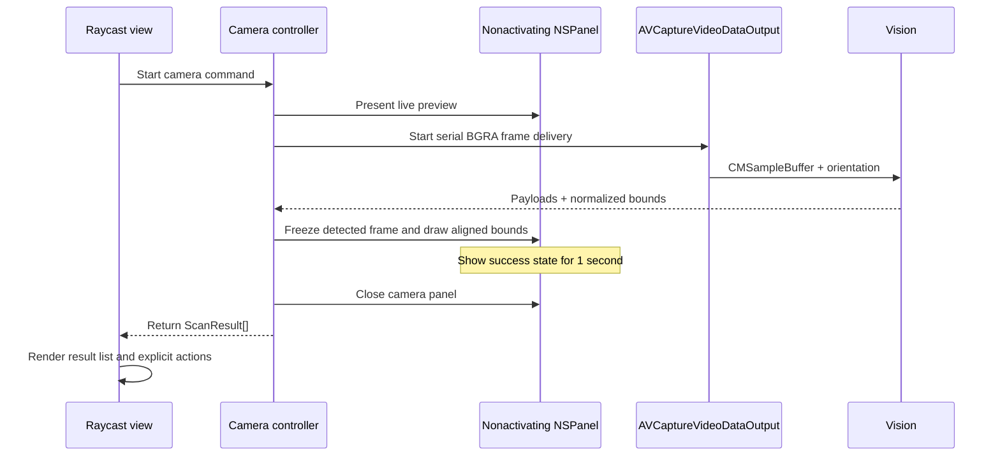

# Architecture and Data Flow

QR Scanner has a cross-platform Raycast TypeScript UI, OS-specific capture adapters, reusable macOS Swift libraries, and a separate macOS CLI package. The TypeScript layer owns Raycast command state, result classification, and user actions. On macOS, `QRScannerCore` owns models, errors, and Vision QR recognition; `QRScannerMac` owns protected APIs and native UI; `QRScannerNative` is the executable Raycast bridge. On Windows, `src/lib/windows.ts` captures images with built-in PowerShell/.NET APIs and `src/lib/qr-image.ts` decodes them locally.

## Component boundaries

| Boundary             | Owner                                                               | Responsibility                                                                         |
| -------------------- | ------------------------------------------------------------------- | -------------------------------------------------------------------------------------- |
| Command entry points | `src/scan-*.tsx`                                                    | Select the camera, screen, or clipboard source.                                        |
| Shared result UI     | `src/components/scan-command.tsx`                                   | Show loading and error states, list results, and expose explicit open or copy actions. |
| OS adapter router    | `src/lib/native.ts`                                                   | Select the Swift bridge on macOS or the TypeScript adapter on Windows.                 |
| Windows capture      | `src/lib/windows.ts`, `src/lib/qr-image.ts`                           | Capture local PNG images and decode all visible QR payloads.                           |
| macOS native bridge  | `swift/Sources/QRScannerNative/SwiftAPI.swift`                        | Invoke Swift through Raycast's `extensions-swift-tools` JSON bridge.                   |
| CLI adapter          | `cli/Sources/QRScannerCLI`                                          | Parse commands and expose scanner results and errors as process-safe JSON.             |
| Core contract        | `swift/ScannerKit/Sources/QRScannerCore`                            | Define result JSON, stable error codes, source values, and Vision QR recognition.      |
| macOS integration    | `swift/ScannerKit/Sources/QRScannerMac`                             | Acquire camera, screen, and clipboard images and present the native camera panel.      |
| TypeScript contract  | `src/lib/result.ts`                                                 | Classify returned payloads and expose only supported explicit actions.                 |

Both adapters return an array of `ScanResult` values. Neither opens a payload automatically. The Raycast action panel is the only place that opens supported URL schemes or copies content.

macOS dependencies flow toward the shared implementation: `QRScannerNative → QRScannerMac → QRScannerCore` and `QRScannerCLI → QRScannerMac → QRScannerCore`. The Windows dependency flow is `Raycast command → windows.ts → PowerShell/.NET capture → qr-image.ts`. The CLI is a separate Swift package with a local dependency on the library products, while only the Raycast macOS package depends on Raycast's macros and build plugins.

## Camera sequence

The panel uses the `.nonactivatingPanel` style and `orderFrontRegardless()`. It remains visible without activating the Swift helper. The Raycast adapter identifies `com.raycast.macos` as the presenting application because Raycast's overlay does not always become macOS's reported frontmost application. It also supplies the bare `raycast://` reveal URL: ordinary `NSRunningApplication.activate` does not show Raycast's launcher window, while opening that application scheme reveals the existing view without launching another command. Other adapters omit the URL and fall back to normal application activation, which preserves the CLI caller's terminal.

`AVCaptureVideoDataOutput` requests `kCVPixelFormatType_32BGRA`. CI fixtures exercise that requested sample-buffer format and the production `CMSampleBuffer → Vision → ScanResult` code path. Hardware capture, TCC, and Raycast integration remain manual acceptance checks. Frame processing runs on one serial queue and discards late frames.

Vision reports normalized rectangles with a lower-left origin. The success overlay is not converted through AVCapture metadata coordinates. Instead, `CameraOverlayGeometry` applies the same `resizeAspectFill` scale and crop used by the frozen `CGImage` layer, then accounts for AppKit's runtime `isGeometryFlipped` value. This keeps the rectangle and frozen frame in one coordinate system.

The first successful frame claims detection under a lock. Later frames cannot schedule another success. The live session stops, the detected frame is retained as a `CGImage`, each QR rectangle is highlighted, and a run-loop timer returns the results after one second. All completion paths converge on a guarded `finish` method so the continuation is resumed at most once.

The Swift helper runs a nested AppKit event loop for the native panel. Work from capture and notification queues is scheduled directly on the main CFRunLoop; enqueueing another main-dispatch block would wait behind the currently running AppKit block.

## Screen and clipboard sequences

Screen scanning enumerates visible displays with `SCShareableContent`, captures each display once with `SCScreenshotManager`, and passes each image through the shared Vision decoder. The TypeScript layer removes duplicate payloads found on multiple displays.

Clipboard scanning reads image data from `NSPasteboard` and uses the same decoder. An absent image and an image containing no QR code remain different errors.

On Windows, one PowerShell invocation captures each display to an isolated per-scan directory. Clipboard scanning saves the current clipboard image to the same kind of temporary directory. `pngjs` exposes RGBA pixels and `jsQR` repeatedly decodes and erases matched regions so one image can return multiple QR codes without a result-count limit. Temporary files are removed in a `finally` path.

The Windows camera command opens the registered `microsoft.windows.camera:` application. It captures only the visible Windows Camera window, scans it repeatedly, and restores Raycast after detection or after the user closes Camera. Camera permission and preview UI therefore remain owned by Windows Camera rather than an extension-managed native binary.

## Privacy and observability

Captured images and decoded results remain local; the extension does not send image data or QR payloads to an external service. macOS images are processed in memory. Windows images briefly exist in an isolated extension-support temporary directory that is removed on every completion path. The extension has no telemetry or extension-owned network service. On macOS, Unified Logging records lifecycle facts such as session start, first-frame dimensions and pixel format, detected count, Vision errors, and completion reason. The implementation does not intentionally log QR payloads or image data; diagnostics must still be reviewed before sharing.

See [troubleshooting.md](troubleshooting.md) for the privacy-safe log predicate.
